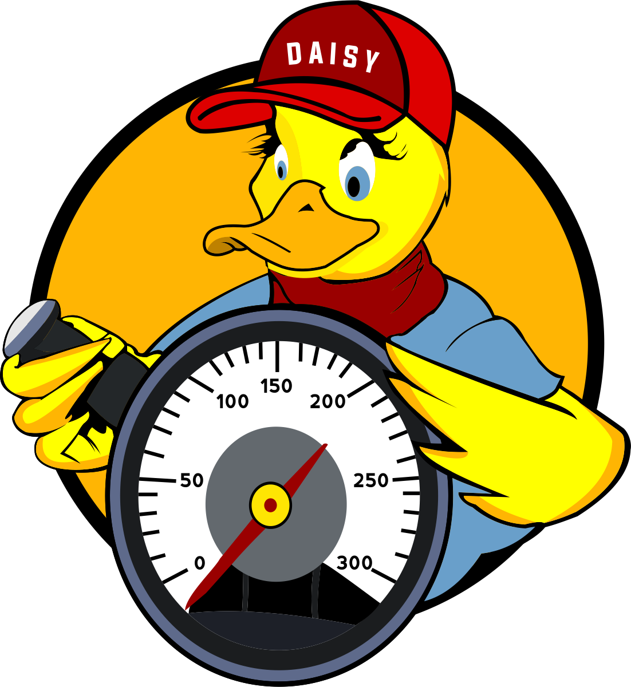

 

daisycc is an optimizing C/C++ compiler collection based on the LLVM infrastructure and the DaCe framework. daisycc lifts loop nests to *stateful dataflow multigraphs (SDFG)* via polyhedral analysis and optimizes them using the [similarity-based transfer tuning algorithm](https://dl.acm.org/doi/abs/10.1145/3577193.3593714).

